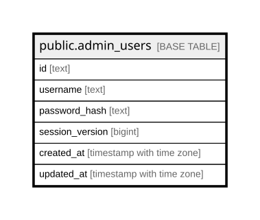

# public.admin_users

## Columns

| Name | Type | Default | Nullable | Children | Parents | Comment |
| ---- | ---- | ------- | -------- | -------- | ------- | ------- |
| id | text |  | false |  |  |  |
| username | text |  | false |  |  |  |
| password_hash | text |  | false |  |  |  |
| session_version | bigint | 1 | false |  |  |  |
| created_at | timestamp with time zone | now() | false |  |  |  |
| updated_at | timestamp with time zone | now() | false |  |  |  |

## Constraints

| Name | Type | Definition |
| ---- | ---- | ---------- |
| admin_users_created_at_not_null | n | NOT NULL created_at |
| admin_users_id_not_null | n | NOT NULL id |
| admin_users_password_hash_not_null | n | NOT NULL password_hash |
| admin_users_session_version_not_null | n | NOT NULL session_version |
| admin_users_updated_at_not_null | n | NOT NULL updated_at |
| admin_users_username_not_null | n | NOT NULL username |
| admin_users_pkey | PRIMARY KEY | PRIMARY KEY (id) |
| admin_users_username_key | UNIQUE | UNIQUE (username) |

## Indexes

| Name | Definition |
| ---- | ---------- |
| admin_users_pkey | CREATE UNIQUE INDEX admin_users_pkey ON public.admin_users USING btree (id) |
| admin_users_username_key | CREATE UNIQUE INDEX admin_users_username_key ON public.admin_users USING btree (username) |

## Relations

---

> Generated by [tbls](https://github.com/k1LoW/tbls)
