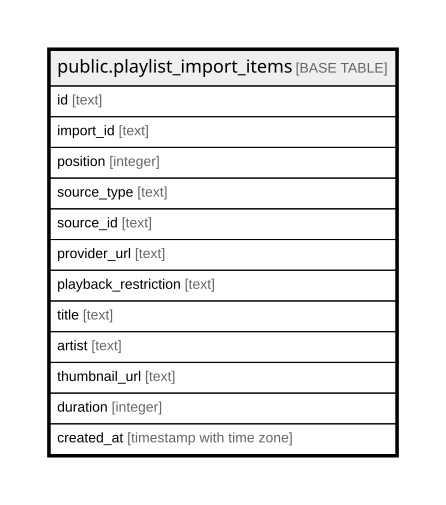

# public.playlist_import_items

## Columns

| Name | Type | Default | Nullable | Children | Parents | Comment |
| ---- | ---- | ------- | -------- | -------- | ------- | ------- |
| id | text |  | false |  |  |  |
| import_id | text |  | false |  |  |  |
| position | integer |  | false |  |  |  |
| source_type | text |  | false |  |  |  |
| source_id | text |  | false |  |  |  |
| provider_url | text | ''::text | false |  |  |  |
| playback_restriction | text | ''::text | false |  |  |  |
| title | text |  | false |  |  |  |
| artist | text | ''::text | false |  |  |  |
| thumbnail_url | text | ''::text | false |  |  |  |
| duration | integer |  | false |  |  |  |
| created_at | timestamp with time zone | now() | false |  |  |  |

## Constraints

| Name | Type | Definition |
| ---- | ---- | ---------- |
| playlist_import_items_artist_not_null | n | NOT NULL artist |
| playlist_import_items_created_at_not_null | n | NOT NULL created_at |
| playlist_import_items_duration_non_negative | CHECK | CHECK ((duration >= 0)) |
| playlist_import_items_duration_not_null | n | NOT NULL duration |
| playlist_import_items_id_not_null | n | NOT NULL id |
| playlist_import_items_import_id_not_null | n | NOT NULL import_id |
| playlist_import_items_playback_restriction_not_null | n | NOT NULL playback_restriction |
| playlist_import_items_position_non_negative | CHECK | CHECK (("position" >= 0)) |
| playlist_import_items_position_not_null | n | NOT NULL "position" |
| playlist_import_items_provider_url_not_null | n | NOT NULL provider_url |
| playlist_import_items_source_id_not_null | n | NOT NULL source_id |
| playlist_import_items_source_type_not_null | n | NOT NULL source_type |
| playlist_import_items_thumbnail_url_not_null | n | NOT NULL thumbnail_url |
| playlist_import_items_title_not_null | n | NOT NULL title |
| playlist_import_items_pkey | PRIMARY KEY | PRIMARY KEY (id) |
| playlist_import_items_import_position_unique | UNIQUE | UNIQUE (import_id, "position") |

## Indexes

| Name | Definition |
| ---- | ---------- |
| playlist_import_items_pkey | CREATE UNIQUE INDEX playlist_import_items_pkey ON public.playlist_import_items USING btree (id) |
| playlist_import_items_import_position_unique | CREATE UNIQUE INDEX playlist_import_items_import_position_unique ON public.playlist_import_items USING btree (import_id, "position") |
| playlist_import_items_import_position_idx | CREATE INDEX playlist_import_items_import_position_idx ON public.playlist_import_items USING btree (import_id, "position") |

## Relations

---

> Generated by [tbls](https://github.com/k1LoW/tbls)
