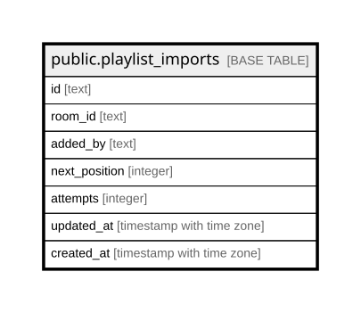

# public.playlist_imports

## Columns

| Name | Type | Default | Nullable | Children | Parents | Comment |
| ---- | ---- | ------- | -------- | -------- | ------- | ------- |
| id | text |  | false |  |  |  |
| room_id | text |  | false |  |  |  |
| added_by | text |  | false |  |  |  |
| next_position | integer | 0 | false |  |  |  |
| attempts | integer | 0 | false |  |  |  |
| updated_at | timestamp with time zone | now() | false |  |  |  |
| created_at | timestamp with time zone | now() | false |  |  |  |

## Constraints

| Name | Type | Definition |
| ---- | ---- | ---------- |
| playlist_imports_added_by_not_null | n | NOT NULL added_by |
| playlist_imports_attempts_non_negative | CHECK | CHECK ((attempts >= 0)) |
| playlist_imports_attempts_not_null | n | NOT NULL attempts |
| playlist_imports_created_at_not_null | n | NOT NULL created_at |
| playlist_imports_id_not_null | n | NOT NULL id |
| playlist_imports_next_position_non_negative | CHECK | CHECK ((next_position >= 0)) |
| playlist_imports_next_position_not_null | n | NOT NULL next_position |
| playlist_imports_room_id_not_null | n | NOT NULL room_id |
| playlist_imports_updated_at_not_null | n | NOT NULL updated_at |
| playlist_imports_pkey | PRIMARY KEY | PRIMARY KEY (id) |

## Indexes

| Name | Definition |
| ---- | ---------- |
| playlist_imports_pkey | CREATE UNIQUE INDEX playlist_imports_pkey ON public.playlist_imports USING btree (id) |
| playlist_imports_processing_idx | CREATE INDEX playlist_imports_processing_idx ON public.playlist_imports USING btree (updated_at, created_at) |

## Relations

---

> Generated by [tbls](https://github.com/k1LoW/tbls)
