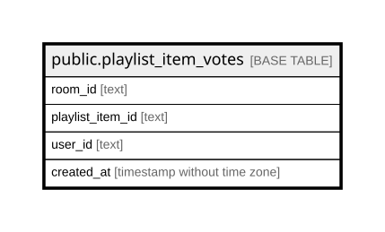

# public.playlist_item_votes

## Columns

| Name | Type | Default | Nullable | Children | Parents | Comment |
| ---- | ---- | ------- | -------- | -------- | ------- | ------- |
| room_id | text |  | false |  |  |  |
| playlist_item_id | text |  | false |  |  |  |
| user_id | text |  | false |  |  |  |
| created_at | timestamp without time zone | (CURRENT_TIMESTAMP AT TIME ZONE 'UTC'::text) | true |  |  |  |

## Constraints

| Name | Type | Definition |
| ---- | ---- | ---------- |
| playlist_item_votes_playlist_item_id_not_null | n | NOT NULL playlist_item_id |
| playlist_item_votes_room_id_not_null | n | NOT NULL room_id |
| playlist_item_votes_user_id_not_null | n | NOT NULL user_id |
| playlist_item_votes_pkey | PRIMARY KEY | PRIMARY KEY (room_id, playlist_item_id, user_id) |

## Indexes

| Name | Definition |
| ---- | ---------- |
| playlist_item_votes_pkey | CREATE UNIQUE INDEX playlist_item_votes_pkey ON public.playlist_item_votes USING btree (room_id, playlist_item_id, user_id) |
| idx_playlist_item_votes_playlist_item | CREATE INDEX idx_playlist_item_votes_playlist_item ON public.playlist_item_votes USING btree (room_id, playlist_item_id) |

## Relations

---

> Generated by [tbls](https://github.com/k1LoW/tbls)
