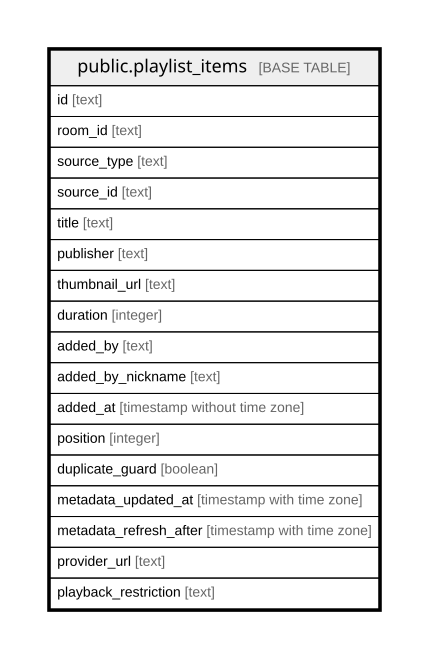

# public.playlist_items

## Columns

| Name | Type | Default | Nullable | Children | Parents | Comment |
| ---- | ---- | ------- | -------- | -------- | ------- | ------- |
| id | text | (gen_random_uuid())::text | false |  |  |  |
| room_id | text |  | false |  |  |  |
| source_type | text |  | false |  |  |  |
| source_id | text |  | false |  |  |  |
| title | text |  | false |  |  |  |
| publisher | text |  | true |  |  |  |
| thumbnail_url | text |  | false |  |  |  |
| duration | integer |  | false |  |  |  |
| added_by | text |  | false |  |  |  |
| added_by_nickname | text |  | true |  |  |  |
| added_at | timestamp without time zone | (CURRENT_TIMESTAMP AT TIME ZONE 'UTC'::text) | true |  |  |  |
| position | integer |  | true |  |  |  |
| duplicate_guard | boolean | true | false |  |  |  |
| metadata_updated_at | timestamp with time zone | now() | false |  |  |  |
| metadata_refresh_after | timestamp with time zone | (now() + '21 days'::interval) | false |  |  |  |
| provider_url | text |  | true |  |  |  |
| playback_restriction | text | ''::text | false |  |  |  |

## Constraints

| Name | Type | Definition |
| ---- | ---- | ---------- |
| playlist_items_added_by_not_null | n | NOT NULL added_by |
| playlist_items_duplicate_guard_not_null | n | NOT NULL duplicate_guard |
| playlist_items_duration_not_null | n | NOT NULL duration |
| playlist_items_id_not_null | n | NOT NULL id |
| playlist_items_metadata_refresh_after_not_null | n | NOT NULL metadata_refresh_after |
| playlist_items_metadata_updated_at_not_null | n | NOT NULL metadata_updated_at |
| playlist_items_playback_restriction_check | CHECK | CHECK ((playback_restriction = ANY (ARRAY[''::text, 'age'::text, 'region'::text, 'embedding'::text]))) |
| playlist_items_playback_restriction_not_null | n | NOT NULL playback_restriction |
| playlist_items_room_id_not_null | n | NOT NULL room_id |
| playlist_items_source_id_not_null | n | NOT NULL source_id |
| playlist_items_source_type_not_null | n | NOT NULL source_type |
| playlist_items_thumbnail_url_not_null | n | NOT NULL thumbnail_url |
| playlist_items_title_not_null | n | NOT NULL title |
| playlist_items_youtube_duration_check | CHECK | CHECK (((source_type <> 'youtube'::text) OR (duration > 0))) |
| playlist_items_pkey | PRIMARY KEY | PRIMARY KEY (id) |

## Indexes

| Name | Definition |
| ---- | ---------- |
| playlist_items_pkey | CREATE UNIQUE INDEX playlist_items_pkey ON public.playlist_items USING btree (id) |
| idx_playlist_items_room_id | CREATE INDEX idx_playlist_items_room_id ON public.playlist_items USING btree (room_id) |
| idx_playlist_items_room_position | CREATE INDEX idx_playlist_items_room_position ON public.playlist_items USING btree (room_id, "position") |
| idx_playlist_items_room_source | CREATE INDEX idx_playlist_items_room_source ON public.playlist_items USING btree (room_id, source_type, source_id) |
| idx_playlist_items_room_added_at | CREATE INDEX idx_playlist_items_room_added_at ON public.playlist_items USING btree (room_id, added_at) |
| idx_playlist_items_duplicate_guard | CREATE UNIQUE INDEX idx_playlist_items_duplicate_guard ON public.playlist_items USING btree (room_id, source_type, source_id) WHERE duplicate_guard |
| idx_playlist_items_metadata_refresh | CREATE INDEX idx_playlist_items_metadata_refresh ON public.playlist_items USING btree (source_type, metadata_refresh_after) |

## Relations

---

> Generated by [tbls](https://github.com/k1LoW/tbls)
