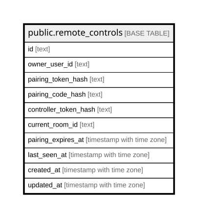

# public.remote_controls

## Columns

| Name | Type | Default | Nullable | Children | Parents | Comment |
| ---- | ---- | ------- | -------- | -------- | ------- | ------- |
| id | text |  | false |  |  |  |
| owner_user_id | text |  | false |  |  |  |
| pairing_token_hash | text |  | false |  |  |  |
| pairing_code_hash | text |  | false |  |  |  |
| controller_token_hash | text | ''::text | false |  |  |  |
| current_room_id | text | ''::text | false |  |  |  |
| pairing_expires_at | timestamp with time zone |  | false |  |  |  |
| last_seen_at | timestamp with time zone |  | false |  |  |  |
| created_at | timestamp with time zone | now() | false |  |  |  |
| updated_at | timestamp with time zone | now() | false |  |  |  |

## Constraints

| Name | Type | Definition |
| ---- | ---- | ---------- |
| remote_controls_controller_token_hash_not_null | n | NOT NULL controller_token_hash |
| remote_controls_created_at_not_null | n | NOT NULL created_at |
| remote_controls_current_room_id_not_null | n | NOT NULL current_room_id |
| remote_controls_id_not_null | n | NOT NULL id |
| remote_controls_last_seen_at_not_null | n | NOT NULL last_seen_at |
| remote_controls_owner_user_id_not_null | n | NOT NULL owner_user_id |
| remote_controls_pairing_code_hash_not_null | n | NOT NULL pairing_code_hash |
| remote_controls_pairing_expires_at_not_null | n | NOT NULL pairing_expires_at |
| remote_controls_pairing_token_hash_not_null | n | NOT NULL pairing_token_hash |
| remote_controls_updated_at_not_null | n | NOT NULL updated_at |
| remote_controls_pkey | PRIMARY KEY | PRIMARY KEY (id) |
| remote_controls_owner_user_id_key | UNIQUE | UNIQUE (owner_user_id) |

## Indexes

| Name | Definition |
| ---- | ---------- |
| remote_controls_pkey | CREATE UNIQUE INDEX remote_controls_pkey ON public.remote_controls USING btree (id) |
| remote_controls_owner_user_id_key | CREATE UNIQUE INDEX remote_controls_owner_user_id_key ON public.remote_controls USING btree (owner_user_id) |
| remote_controls_pairing_token_hash_idx | CREATE UNIQUE INDEX remote_controls_pairing_token_hash_idx ON public.remote_controls USING btree (pairing_token_hash) WHERE (pairing_token_hash <> ''::text) |
| remote_controls_controller_token_hash_idx | CREATE UNIQUE INDEX remote_controls_controller_token_hash_idx ON public.remote_controls USING btree (controller_token_hash) WHERE (controller_token_hash <> ''::text) |

## Relations

---

> Generated by [tbls](https://github.com/k1LoW/tbls)
