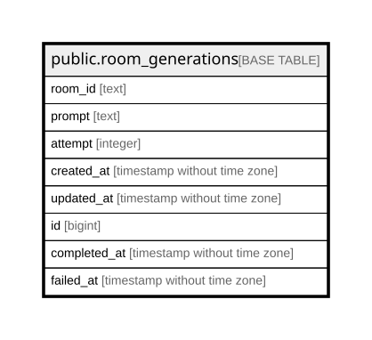

# public.room_generations

## Columns

| Name | Type | Default | Nullable | Children | Parents | Comment |
| ---- | ---- | ------- | -------- | -------- | ------- | ------- |
| room_id | text |  | false |  |  |  |
| prompt | text |  | false |  |  |  |
| attempt | integer | 0 | false |  |  |  |
| created_at | timestamp without time zone | (CURRENT_TIMESTAMP AT TIME ZONE 'UTC'::text) | false |  |  |  |
| updated_at | timestamp without time zone | (CURRENT_TIMESTAMP AT TIME ZONE 'UTC'::text) | false |  |  |  |
| id | bigint |  | false |  |  |  |
| completed_at | timestamp without time zone |  | true |  |  |  |
| failed_at | timestamp without time zone |  | true |  |  |  |

## Constraints

| Name | Type | Definition |
| ---- | ---- | ---------- |
| room_generations_attempt_check | CHECK | CHECK (((attempt >= 0) AND (attempt <= 5))) |
| room_generations_attempt_not_null | n | NOT NULL attempt |
| room_generations_created_at_not_null | n | NOT NULL created_at |
| room_generations_failure_attempt | CHECK | CHECK (((failed_at IS NULL) OR (attempt >= 5))) |
| room_generations_id_not_null | n | NOT NULL id |
| room_generations_prompt_check | CHECK | CHECK (((length(btrim(prompt)) >= 1) AND (length(btrim(prompt)) <= 300))) |
| room_generations_prompt_not_null | n | NOT NULL prompt |
| room_generations_room_id_not_null | n | NOT NULL room_id |
| room_generations_single_outcome | CHECK | CHECK (((completed_at IS NULL) OR (failed_at IS NULL))) |
| room_generations_updated_at_not_null | n | NOT NULL updated_at |
| room_generations_pkey | PRIMARY KEY | PRIMARY KEY (id) |

## Indexes

| Name | Definition |
| ---- | ---------- |
| room_generations_pkey | CREATE UNIQUE INDEX room_generations_pkey ON public.room_generations USING btree (id) |
| room_generations_claim_idx | CREATE INDEX room_generations_claim_idx ON public.room_generations USING btree (updated_at, created_at) WHERE ((completed_at IS NULL) AND (failed_at IS NULL)) |
| room_generations_single_active_idx | CREATE UNIQUE INDEX room_generations_single_active_idx ON public.room_generations USING btree ((true)) WHERE ((completed_at IS NULL) AND (failed_at IS NULL) AND (attempt < 5)) |
| room_generations_room_created_idx | CREATE INDEX room_generations_room_created_idx ON public.room_generations USING btree (room_id, created_at) |
| room_generations_completed_at_idx | CREATE INDEX room_generations_completed_at_idx ON public.room_generations USING btree (completed_at) WHERE (completed_at IS NOT NULL) |
| room_generations_failed_at_idx | CREATE INDEX room_generations_failed_at_idx ON public.room_generations USING btree (failed_at) WHERE (failed_at IS NOT NULL) |

## Relations

---

> Generated by [tbls](https://github.com/k1LoW/tbls)
