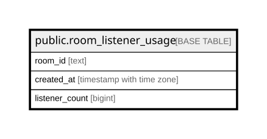

# public.room_listener_usage

## Columns

| Name | Type | Default | Nullable | Children | Parents | Comment |
| ---- | ---- | ------- | -------- | -------- | ------- | ------- |
| room_id | text |  | false |  |  |  |
| created_at | timestamp with time zone |  | false |  |  |  |
| listener_count | bigint |  | false |  |  |  |

## Constraints

| Name | Type | Definition |
| ---- | ---- | ---------- |
| room_listener_usage_created_at_not_null | n | NOT NULL created_at |
| room_listener_usage_listener_count_check | CHECK | CHECK ((listener_count >= 0)) |
| room_listener_usage_listener_count_not_null | n | NOT NULL listener_count |
| room_listener_usage_room_id_not_null | n | NOT NULL room_id |
| room_listener_usage_pkey | PRIMARY KEY | PRIMARY KEY (room_id, created_at) |

## Indexes

| Name | Definition |
| ---- | ---------- |
| room_listener_usage_pkey | CREATE UNIQUE INDEX room_listener_usage_pkey ON public.room_listener_usage USING btree (room_id, created_at) |
| idx_room_listener_usage_created_at | CREATE INDEX idx_room_listener_usage_created_at ON public.room_listener_usage USING btree (created_at) |

## Relations

---

> Generated by [tbls](https://github.com/k1LoW/tbls)
