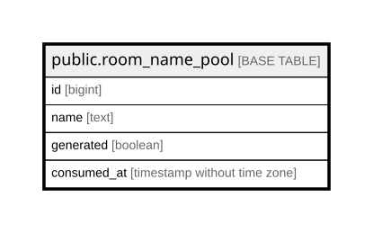

# public.room_name_pool

## Columns

| Name | Type | Default | Nullable | Children | Parents | Comment |
| ---- | ---- | ------- | -------- | -------- | ------- | ------- |
| id | bigint |  | false |  |  |  |
| name | text |  | false |  |  |  |
| generated | boolean | true | false |  |  |  |
| consumed_at | timestamp without time zone |  | true |  |  |  |

## Constraints

| Name | Type | Definition |
| ---- | ---- | ---------- |
| room_name_pool_generated_not_null | n | NOT NULL generated |
| room_name_pool_id_not_null | n | NOT NULL id |
| room_name_pool_name_not_null | n | NOT NULL name |
| room_name_pool_pkey | PRIMARY KEY | PRIMARY KEY (id) |

## Indexes

| Name | Definition |
| ---- | ---------- |
| room_name_pool_pkey | CREATE UNIQUE INDEX room_name_pool_pkey ON public.room_name_pool USING btree (id) |
| room_name_pool_name_idx | CREATE UNIQUE INDEX room_name_pool_name_idx ON public.room_name_pool USING btree (name) |
| room_name_pool_available_id_idx | CREATE INDEX room_name_pool_available_id_idx ON public.room_name_pool USING btree (id) WHERE (consumed_at IS NULL) |

## Relations

---

> Generated by [tbls](https://github.com/k1LoW/tbls)
