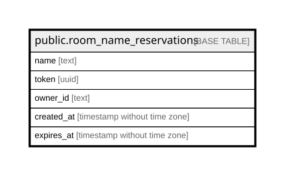

# public.room_name_reservations

## Columns

| Name | Type | Default | Nullable | Children | Parents | Comment |
| ---- | ---- | ------- | -------- | -------- | ------- | ------- |
| name | text |  | false |  |  |  |
| token | uuid | gen_random_uuid() | false |  |  |  |
| owner_id | text |  | false |  |  |  |
| created_at | timestamp without time zone | (CURRENT_TIMESTAMP AT TIME ZONE 'UTC'::text) | false |  |  |  |
| expires_at | timestamp without time zone |  | false |  |  |  |

## Constraints

| Name | Type | Definition |
| ---- | ---- | ---------- |
| room_name_reservations_created_at_not_null | n | NOT NULL created_at |
| room_name_reservations_expires_at_not_null | n | NOT NULL expires_at |
| room_name_reservations_expiry_check | CHECK | CHECK ((expires_at > created_at)) |
| room_name_reservations_name_not_null | n | NOT NULL name |
| room_name_reservations_owner_id_not_null | n | NOT NULL owner_id |
| room_name_reservations_token_not_null | n | NOT NULL token |
| room_name_reservations_pkey | PRIMARY KEY | PRIMARY KEY (name) |
| room_name_reservations_token_key | UNIQUE | UNIQUE (token) |
| room_name_reservations_owner_id_key | UNIQUE | UNIQUE (owner_id) |

## Indexes

| Name | Definition |
| ---- | ---------- |
| room_name_reservations_pkey | CREATE UNIQUE INDEX room_name_reservations_pkey ON public.room_name_reservations USING btree (name) |
| room_name_reservations_token_key | CREATE UNIQUE INDEX room_name_reservations_token_key ON public.room_name_reservations USING btree (token) |
| room_name_reservations_owner_id_key | CREATE UNIQUE INDEX room_name_reservations_owner_id_key ON public.room_name_reservations USING btree (owner_id) |
| room_name_reservations_expires_at_idx | CREATE INDEX room_name_reservations_expires_at_idx ON public.room_name_reservations USING btree (expires_at) |

## Relations

---

> Generated by [tbls](https://github.com/k1LoW/tbls)
