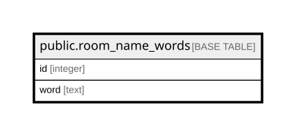

# public.room_name_words

## Columns

| Name | Type | Default | Nullable | Children | Parents | Comment |
| ---- | ---- | ------- | -------- | -------- | ------- | ------- |
| id | integer |  | false |  |  |  |
| word | text |  | false |  |  |  |

## Constraints

| Name | Type | Definition |
| ---- | ---- | ---------- |
| room_name_words_id_not_null | n | NOT NULL id |
| room_name_words_word_not_null | n | NOT NULL word |
| room_name_words_pkey | PRIMARY KEY | PRIMARY KEY (id) |
| room_name_words_word_key | UNIQUE | UNIQUE (word) |

## Indexes

| Name | Definition |
| ---- | ---------- |
| room_name_words_pkey | CREATE UNIQUE INDEX room_name_words_pkey ON public.room_name_words USING btree (id) |
| room_name_words_word_key | CREATE UNIQUE INDEX room_name_words_word_key ON public.room_name_words USING btree (word) |

## Relations

---

> Generated by [tbls](https://github.com/k1LoW/tbls)
