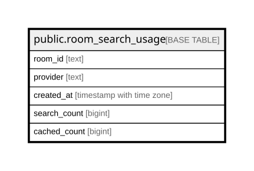

# public.room_search_usage

## Columns

| Name | Type | Default | Nullable | Children | Parents | Comment |
| ---- | ---- | ------- | -------- | -------- | ------- | ------- |
| room_id | text |  | false |  |  |  |
| provider | text |  | false |  |  |  |
| created_at | timestamp with time zone |  | false |  |  |  |
| search_count | bigint | 0 | false |  |  |  |
| cached_count | bigint | 0 | false |  |  |  |

## Constraints

| Name | Type | Definition |
| ---- | ---- | ---------- |
| room_search_usage_cached_count_check | CHECK | CHECK ((cached_count >= 0)) |
| room_search_usage_cached_count_not_null | n | NOT NULL cached_count |
| room_search_usage_created_at_not_null | n | NOT NULL created_at |
| room_search_usage_provider_not_null | n | NOT NULL provider |
| room_search_usage_room_id_not_null | n | NOT NULL room_id |
| room_search_usage_search_count_check | CHECK | CHECK ((search_count >= 0)) |
| room_search_usage_search_count_not_null | n | NOT NULL search_count |
| room_search_usage_pkey | PRIMARY KEY | PRIMARY KEY (room_id, provider, created_at) |

## Indexes

| Name | Definition |
| ---- | ---------- |
| room_search_usage_pkey | CREATE UNIQUE INDEX room_search_usage_pkey ON public.room_search_usage USING btree (room_id, provider, created_at) |
| idx_room_search_usage_created_at | CREATE INDEX idx_room_search_usage_created_at ON public.room_search_usage USING btree (created_at) |

## Relations

---

> Generated by [tbls](https://github.com/k1LoW/tbls)
