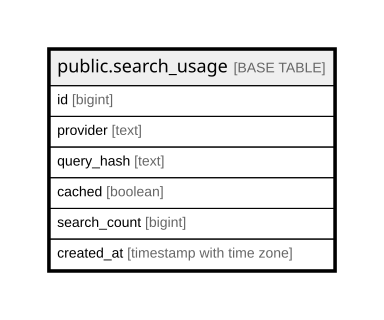

# public.search_usage

## Columns

| Name | Type | Default | Nullable | Children | Parents | Comment |
| ---- | ---- | ------- | -------- | -------- | ------- | ------- |
| id | bigint |  | false |  |  |  |
| provider | text |  | false |  |  |  |
| query_hash | text |  | false |  |  |  |
| cached | boolean |  | false |  |  |  |
| search_count | bigint | 1 | false |  |  |  |
| created_at | timestamp with time zone | date_trunc('hour'::text, now()) | false |  |  |  |

## Constraints

| Name | Type | Definition |
| ---- | ---- | ---------- |
| search_usage_hourly_cached_not_null | n | NOT NULL cached |
| search_usage_hourly_created_at_not_null | n | NOT NULL created_at |
| search_usage_hourly_id_not_null | n | NOT NULL id |
| search_usage_hourly_provider_not_null | n | NOT NULL provider |
| search_usage_hourly_query_hash_not_null | n | NOT NULL query_hash |
| search_usage_hourly_search_count_not_null | n | NOT NULL search_count |
| search_usage_hourly_pkey | PRIMARY KEY | PRIMARY KEY (id) |

## Indexes

| Name | Definition |
| ---- | ---------- |
| search_usage_hourly_pkey | CREATE UNIQUE INDEX search_usage_hourly_pkey ON public.search_usage USING btree (id) |
| idx_search_usage_hourly | CREATE UNIQUE INDEX idx_search_usage_hourly ON public.search_usage USING btree (provider, query_hash, cached, created_at) |
| idx_search_usage_created_at | CREATE INDEX idx_search_usage_created_at ON public.search_usage USING btree (created_at) |

## Relations

---

> Generated by [tbls](https://github.com/k1LoW/tbls)
